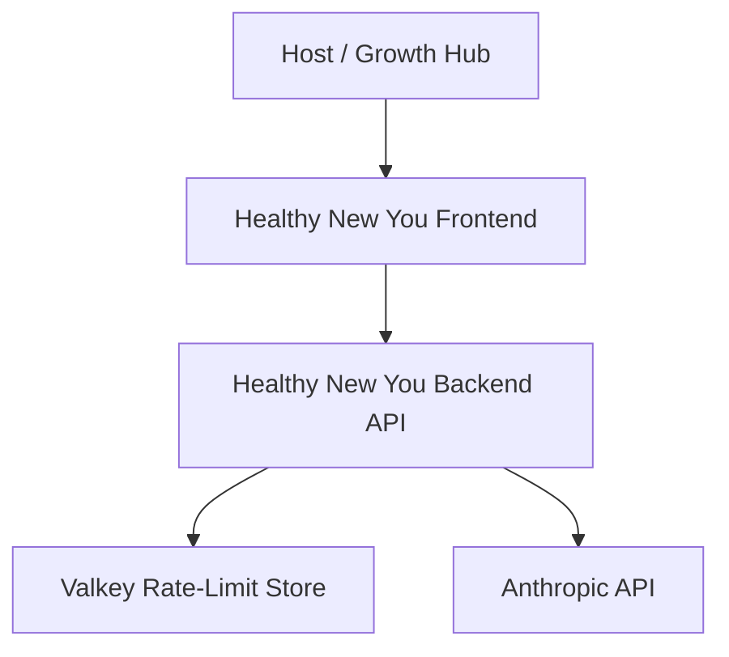
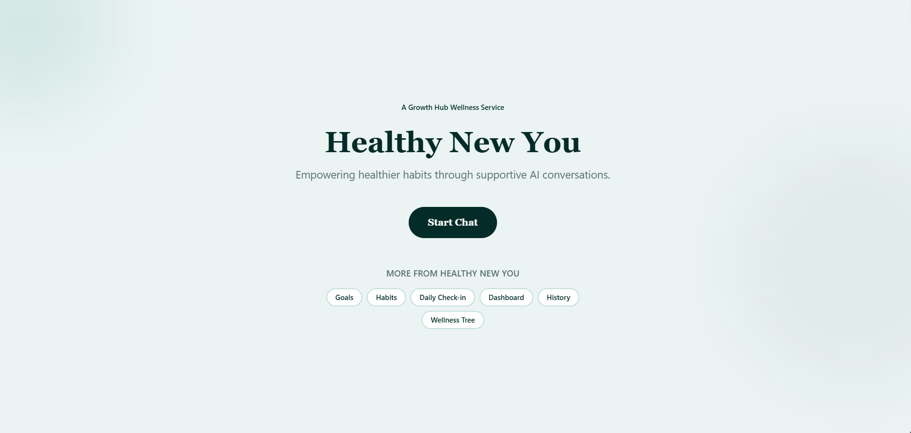
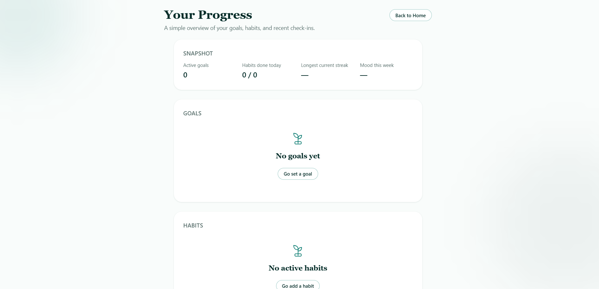
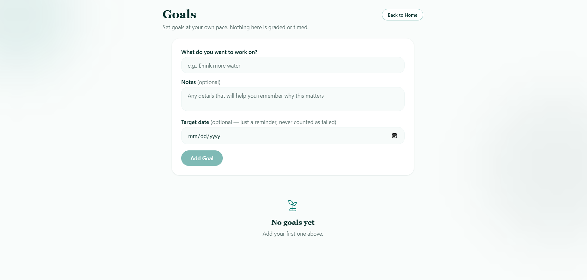
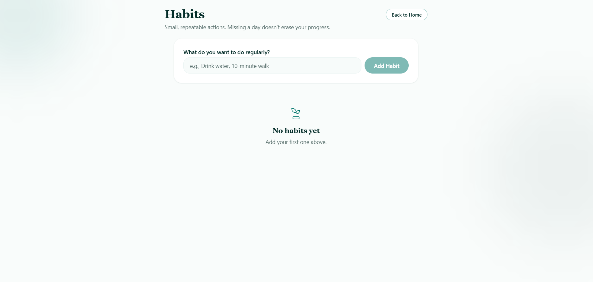
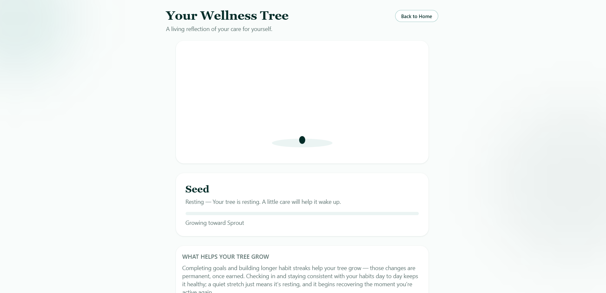
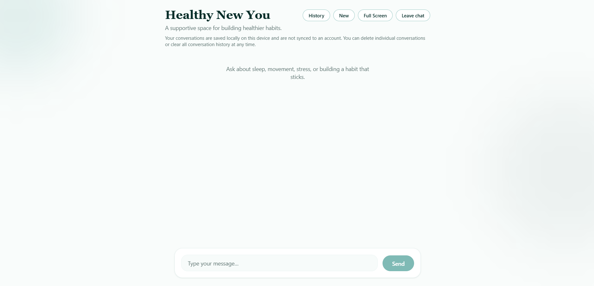

# Healthy New You

**Healthy New You (HNY)** is a production-deployed wellness application designed to help users build healthier routines through goal setting, habit tracking, progress reflection, a visual Wellness Tree, and AI-assisted coaching.

> **Showcase repository:** This repository documents the project, architecture, engineering decisions, and production milestones. The production source code is maintained privately.

---

## Overview

Healthy New You combines structured wellness tools with AI-assisted guidance while keeping users in control of all changes to their goals and habits.

The application was developed from an early prototype into a production-ready system with a dedicated frontend, backend API, distributed rate limiting, cloud deployment, operational safeguards, and an embedded host experience.

The project focuses on:

- practical goal and habit management
- progress awareness and longitudinal reflection
- user-controlled AI assistance
- privacy-conscious application design
- production reliability and abuse resistance
- responsive and accessible user experience

Healthy New You is a **wellness support tool**, not a medical diagnostic or treatment system.

---

## Current Status

**Production release: complete**

The current production baseline has been deployed, tested, and frozen after production acceptance.

Key release milestones include:

- production frontend deployment
- production backend deployment
- managed Valkey infrastructure
- Anthropic-powered AI integration
- distributed rate limiting
- concurrency controls
- emergency AI kill switch
- fail-closed behavior for unavailable rate-limit infrastructure
- strict request validation
- production CORS configuration
- bounded production error logging
- iframe security policy for the authorized host origin
- Growth Hub embed acceptance
- clean Git production baseline

---

## Core Features

### Goals

Users can create and manage wellness goals while tracking their progress over time.

### Habits

Users can create habits, perform check-ins, and use their consistency data as part of the broader wellness experience.

### Wellness Tree

A deterministic visual representation of user progress that gives users a simple, motivating way to see their wellness activity evolve.

### AI Wellness Assistant

The assistant can:

- discuss user goals and habits
- provide wellness-oriented coaching
- recognize existing goals and habits
- interpret recent progress patterns
- suggest new goals or habits
- propose updates to supported fields
- explain trends without making unsupported psychological conclusions

AI-generated changes are **proposal-based**. The user must explicitly confirm actions before application state is modified.

### Longitudinal Intelligence

Healthy New You can compare recent user activity across defined time windows and help users reflect on changes in consistency and participation.

The assistant is intentionally constrained from inventing progress, diagnosing emotional states, or treating limited trend data as proof of long-term behavior.

---

## High-Level Architecture



### Frontend

A responsive web application that handles the user interface, local wellness data, goal and habit interactions, progress visualization, and communication with the backend API.

### Backend

A Node.js/Express service responsible for:

- validating requests
- applying abuse controls
- enforcing concurrency limits
- building AI context
- communicating with Anthropic
- normalizing provider errors
- protecting backend-only secrets

### Valkey

A managed Valkey instance supports the production distributed request limiter.

### AI Provider

Anthropic provides the language-model layer used by the Healthy New You assistant.

---

## Technology Stack

### Frontend

- React
- TypeScript
- Vite
- browser localStorage

### Backend

- Node.js
- TypeScript
- Express
- Anthropic SDK
- `express-rate-limit`
- `rate-limit-redis`
- `ioredis`

### Infrastructure

- Render Static Site
- Render Web Service
- Render Key Value / Valkey
- GitHub
- Git

---

## Production Engineering

A major part of Healthy New You was taking the application beyond local development and building a production-safe deployment.

### Distributed Rate Limiting

The production API uses a shared Valkey-backed rate limiter rather than relying only on in-memory counters.

### Concurrency Protection

The backend limits how many AI requests can be in flight simultaneously, including a stricter per-client ceiling.

### Emergency AI Kill Switch

Production includes an environment-controlled switch that can disable AI chat without taking the rest of the application offline.

When disabled:

- the backend health endpoint remains available
- AI chat returns a bounded service-unavailable response
- requests do not continue to the provider

### Fail-Closed Infrastructure Behavior

If the distributed limiter becomes unavailable, the chat route fails closed rather than bypassing the limiter and continuing to the AI provider.

### Request Validation

The API rejects:

- malformed JSON
- oversized request bodies
- unrecognized request properties
- invalid application data shapes

### Production CORS

The backend only authorizes the configured production frontend origin for browser cross-origin access.

### Framing Policy

The production frontend uses a Content Security Policy `frame-ancestors` rule so it can be embedded by the authorized host while preventing arbitrary third-party framing.

### Secret Separation

Backend secrets remain server-side and are not included in the frontend bundle.

---

## Reliability & Security Acceptance

The production release was manually exercised against several real deployment scenarios, including:

- normal production chat
- malformed request handling
- oversized request handling
- CORS allow/deny behavior
- distributed frequency limiting
- per-client concurrency limiting
- emergency AI shutdown and recovery
- Valkey outage and recovery
- forwarded-IP spoofing attempts
- frontend secret exposure checks
- bounded production logging
- private Valkey access configuration
- single-instance backend topology
- host iframe loading and interaction

Automated backend tests also cover the core middleware, validation, AI context, proposal handling, rate limiting, concurrency behavior, Redis/Valkey readiness, and failure paths.

---

## Privacy & Safety Design

Healthy New You intentionally limits the authority of the AI assistant.

The assistant is designed to:

- distinguish observation from inference
- avoid psychological diagnosis
- avoid fabricating user progress
- avoid treating short-term patterns as permanent traits
- propose application changes rather than silently making them
- use only supported application fields
- keep backend credentials out of client-side code

Current user wellness data is primarily browser-local rather than stored in a centralized user database.

---

## Engineering Challenges Solved

### Turning AI suggestions into safe application actions

The assistant needed to be useful without being given uncontrolled authority over user data. The solution was a proposal-and-confirmation workflow with strict validation.

### Maintaining useful longitudinal context

Progress comparisons needed to be deterministic and grounded in actual app data rather than generated estimates.

### Protecting a publicly reachable AI endpoint

Because every valid AI request has a real provider cost, the production architecture uses several independent controls:

- request-shape limits
- distributed frequency limiting
- concurrency limiting
- provider-side spending controls
- an operational kill switch

### Deploying behind cloud infrastructure safely

Production deployment required validating client identity behavior, CORS, rate-limit persistence, failure handling, environment configuration, service scaling, private Valkey networking, and host iframe restrictions.

### Moving from temporary development hosting to production

The application transitioned from local/ngrok development to a permanent Render deployment with a stable frontend URL, backend service, and managed supporting infrastructure.

---

## Development Milestones

Healthy New You was developed incrementally:

1. Core wellness application
2. Deterministic Wellness Tree
3. AI wellness awareness
4. AI-created Goals and Habits
5. Awareness of existing Goals and Habits
6. AI-assisted updates
7. Progress awareness
8. Coaching Intelligence
9. Proactive user-controlled assistance
10. Longitudinal Intelligence
11. Reliability, accessibility, privacy, security, deployment, and production acceptance

The current release represents the completion of the initial product-development and production-deployment roadmap.

---

## Product Preview

### Home



### Progress Dashboard



### Goals



### Habits



### Wellness Tree



### AI Assistant



> The screenshots above use a clean/demo state and contain no private wellness information. The AI Assistant image can later be replaced with an approved demo conversation to show the coaching experience more clearly.

---

## Demo

A public live demo link is intentionally omitted until public sharing of the hosted Growth Hub environment is approved.

For portfolio or recruiting conversations, a guided demo can be provided separately.

---

## Repository Structure

This showcase repository is intentionally lightweight.

Suggested structure:

```text
healthy-new-you-showcase/
├── README.md
├── docs/
│   ├── architecture.md
│   └── images/
└── LICENSE
```

The private production repository contains the application source, production configuration, test suites, and deployment implementation.

---

## What I Learned

Building Healthy New You required work across both product development and production engineering, including:

- full-stack TypeScript development
- AI feature design
- deterministic application state
- validation and safe tool/action design
- REST API development
- rate limiting and concurrency control
- managed cloud infrastructure
- security testing
- production incident controls
- Git/GitHub release management
- iframe integration
- deployment acceptance testing

The project reinforced the difference between **making a feature work locally** and **making a system reliable enough to operate in production**.

---

## Future Direction

The next phase is focused on production observation and user feedback rather than immediately expanding the feature set.

Potential future work may include:

- privacy-preserving product analytics
- improved operational monitoring
- additional user-requested wellness insights
- account-based persistence if the product eventually requires cross-device data
- trusted host identity integration if the hosting platform provides an authentication mechanism

Future development will be driven by real user needs rather than adding features without evidence.

---

## Author

**James Mitchell**

Computer Science student focused on cybersecurity, software engineering, AI systems, and production application development.

---

## Source Availability

Healthy New You is currently maintained as proprietary/private source code.

This public repository is intended as a **technical and portfolio showcase**, not an open-source distribution of the production application.

Selected implementation details or code samples may be shared separately when appropriate.
